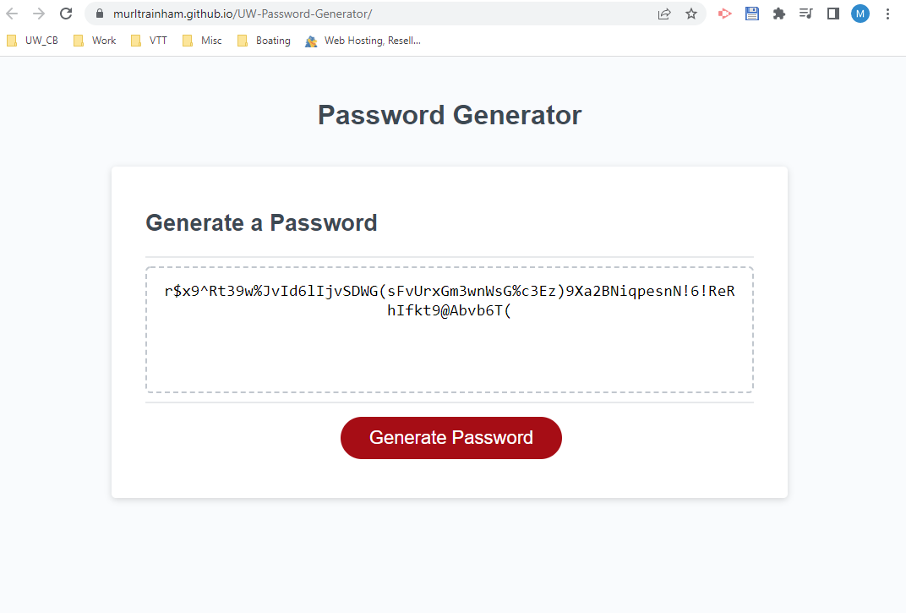

# **<u>Password  Generator</u>**

This is a password generator for UW coding boot camp project 3. Acceptance criteria included generating a password of 8 to 128 characters using user prompted input (lowercase, uppercase, numeric, and/or special characters).

## <u>Lessons learned</u>

- Split method usage for splitting up an array can save considerable time
- ~~ in lieu of Math.floor can save considerable time if using JS Math repeatedly 
- I need to study up more on conditional statements and ensure my general JS syntax improves. Ignorant mistakes (misplaced and/or forgotten curly brackets) that were easily avoided caused a majority of my issues. 

